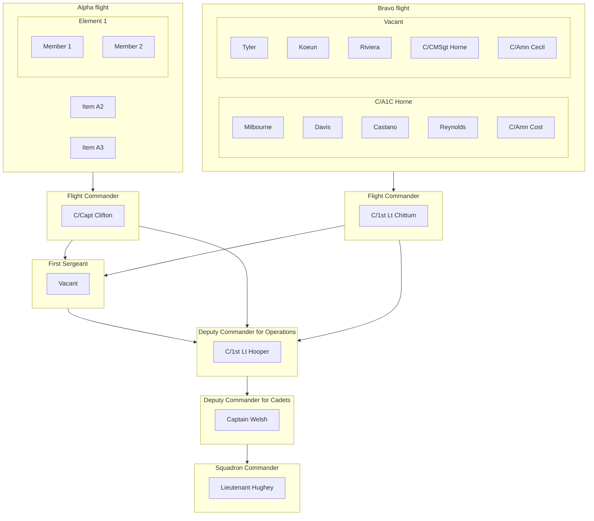

```mermaid
graph TD
    subgraph Alpha_Flight[Alpha flight]
        subgraph Element_A1[Element 1]
	        AA1[Member 1]
	        AA2[Member 2]
	    end
        A2[Item A2]
        A3[Item A3]
    end
    
    subgraph Bravo_Flight[Bravo flight]
        subgraph Element_B1[C/A1C Horne]
	        BA2[Milbourne]
	        BA3[Davis]
	        BA4[Castano]
	        BA5[Reynolds]
	        BA6[C/Amn Cost]
	    end
        subgraph Element_B2[Vacant]
	        BB1[Tyler]
	        BB2[Koeun]
	        BB3[Riviera]
	        BB4[C/CMSgt Horne]
	        BB5[C/Amn Cecil]
	    end
    end
    
    subgraph Flight_Commander1[Flight Commander]
	    C1[C/Capt Clifton]
	end
	
	subgraph Flight_Commander2[Flight Commander]
		D1[C/1st Lt Chittum]
	end
	
	subgraph C/DCO[Deputy Commander for Operations]
		E1[C/1st Lt Hooper]
	end
	
	subgraph DCC[Deputy Commander for Cadets]
		F1[Captain Welsh]
	end
	subgraph SqCo[Squadron Commander]
		G1[Lieutenant Hughey]
	end
	subgraph 1stSgt[First Sergeant]
		H1[Vacant]
	end
	
	Alpha_Flight --> Flight_Commander1
	Bravo_Flight --> Flight_Commander2
    Flight_Commander1 --> 1stSgt
    Flight_Commander2 --> 1stSgt
    1stSgt --> C/DCO
    
    Flight_Commander1 --> C/DCO
    Flight_Commander2 --> C/DCO
    C/DCO --> DCC
    DCC --> SqCo

```

